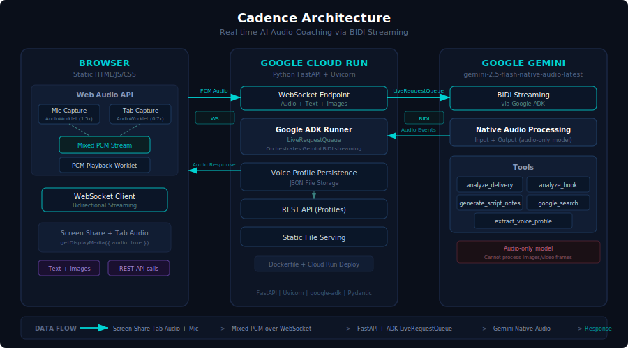

# Cadence — AI Creative Director

AI creative director that learns how you perform — not just what you say — and co-creates content in your voice.

Built with Gemini 2.5 Flash Native Audio, Google ADK, and deployed on Google Cloud Run.

## The Problem

Content creators have a delivery style that makes their content work — deadpan sarcasm, strategic pauses, rapid-fire pacing, facial expressions timed to punchlines. But when they try to use AI to help write scripts, they can't explain that style in a text prompt. The AI produces generic content that sounds like everyone else.

## The Solution

Cadence listens to your actual videos through real-time audio streaming. It analyzes your vocal delivery patterns — pacing, humor timing, emotional arcs, hook styles, signature moves — and builds a persistent voice profile that gets smarter every session.

Then it uses that profile to:
- **Study** your delivery patterns across multiple videos
- **Scout** trending content that matches your specific style using Google Search
- **Create** full scripts written in your voice with line-by-line delivery coaching

## Architecture



**Frontend:** Vanilla JavaScript with Web Audio API. Three AudioWorklet processors handle mic capture (1.5x gain), tab audio capture (0.7x gain), and PCM playback — all off the main thread for low-latency streaming.

**Backend:** Python FastAPI server on Google Cloud Run. WebSocket endpoint receives mixed PCM audio and routes it through Google ADK's LiveRequestQueue to Gemini's BIDI streaming API. Voice profiles persist as JSON between sessions.

**AI:** Gemini 2.5 Flash Native Audio model processes raw audio input (not transcripts) and responds with voice. Custom tools handle delivery analysis, hook analysis, script generation, and voice profile extraction.

## Tech Stack

- **AI Model:** Gemini 2.5 Flash Native Audio (`gemini-2.5-flash-native-audio-latest`)
- **Agent Framework:** Google ADK (BIDI streaming via `LiveRequestQueue` + `Runner`)
- **Backend:** Python, FastAPI, Uvicorn
- **Frontend:** JavaScript, Web Audio API (AudioWorklet)
- **Streaming:** WebSocket (client ↔ server), BIDI (server ↔ Gemini)
- **Deployment:** Google Cloud Run, Docker
- **Testing:** Playwright

## Getting Started

### Prerequisites

- Python 3.12+
- Node.js 18+ (for Playwright tests)
- Google Cloud API key with Gemini access

### Local Development

```bash
# Clone the repo
git clone https://github.com/brookejlacey/cadence.git
cd cadence

# Set up environment
cp app/.env.example app/.env
# Edit app/.env and add your GOOGLE_API_KEY

# Install Python dependencies
pip install -r requirements.txt

# Run the server
python app/main.py
```

Open `http://localhost:8000` in Chrome. Click **Start Session**, share a tab with a video playing (check "Share tab audio"), and start talking to Cadence.

### Running Tests

```bash
# Install Playwright
npm install
npx playwright install chromium

# Start server and run tests
python app/main.py &
npx playwright test
```

### Deploy to Google Cloud Run

```bash
# Authenticate with Google Cloud
gcloud auth login
gcloud config set project YOUR_PROJECT_ID

# Deploy (requires Docker + Cloud Build)
chmod +x deploy.sh
./deploy.sh
```

Or deploy manually:

```bash
gcloud run deploy cadence \
  --source . \
  --region us-central1 \
  --allow-unauthenticated \
  --port 8000 \
  --session-affinity \
  --timeout 3600 \
  --set-env-vars "GOOGLE_API_KEY=your_key,GOOGLE_CLOUD_PROJECT=your_project" \
  --memory 512Mi --cpu 1
```

## How It Works

1. **Share a tab** — Creator shares a Chrome tab with their video content playing
2. **Mixed audio** — Mic audio (1.5x) and tab audio (0.7x) are mixed into a single 16kHz PCM stream via AudioWorklet
3. **WebSocket** — Mixed PCM streams to the FastAPI backend over WebSocket
4. **Google ADK** — Backend routes audio through `LiveRequestQueue` to Gemini's BIDI streaming API
5. **Gemini analyzes** — Native audio model processes the raw vocal performance (not a transcript)
6. **Voice response** — Gemini responds with 24kHz audio streamed back through WebSocket to the browser's playback worklet
7. **Profile persistence** — Observations and delivery patterns are saved to the creator's voice profile for future sessions

## Key Technical Decisions

- **Audio-only model:** Gemini's native audio model can't process video frames, only audio. This turned out to be surprisingly effective — vocal delivery patterns carry most of the signal.
- **Mixed audio stream:** Sending mic and tab audio as separate streams caused rate limit disconnects. Mixing them into one PCM stream with gain balancing solved this.
- **Server-side BIDI retry:** Gemini's BIDI streaming drops connections periodically. The server automatically restarts the stream (up to 5 retries) without dropping the client WebSocket.
- **Voice-first UX:** Chat transcript is reserved for typed messages and system info. Cadence's voice responses are the primary output — no janky live transcription.

## Project Structure

```
cadence/
├── app/
│   ├── main.py                          # FastAPI server + WebSocket handler
│   ├── profiles.py                      # Voice profile persistence
│   ├── cadence_agents/
│   │   ├── agent.py                     # Main Cadence coordinator agent
│   │   ├── tools/
│   │   │   └── content_analysis.py      # Delivery analysis tools (5 functions)
│   │   └── sub_agents/                  # Specialized sub-agents
│   └── static/
│       ├── index.html
│       ├── css/style.css
│       └── js/
│           ├── app.js                   # Main frontend application
│           ├── audio-player.js          # PCM playback (24kHz)
│           ├── audio-recorder.js        # Mic capture (16kHz)
│           └── pcm-*-processor.js       # AudioWorklet processors
├── tests/
│   └── e2e.spec.js                      # Playwright E2E tests (16 tests)
├── deploy.sh                            # Automated Cloud Run deployment
├── Dockerfile
├── architecture.svg
└── requirements.txt
```

## Live Demo

**https://cadence-862848485146.us-central1.run.app**

Requires Chrome (for tab audio capture via `getDisplayMedia`).
