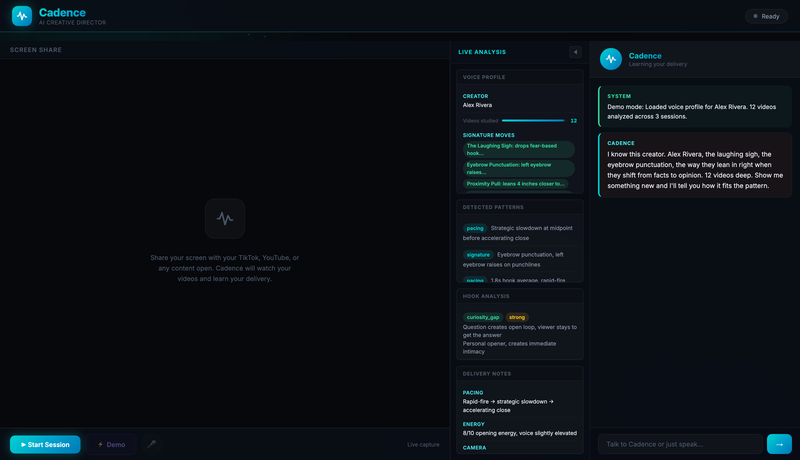
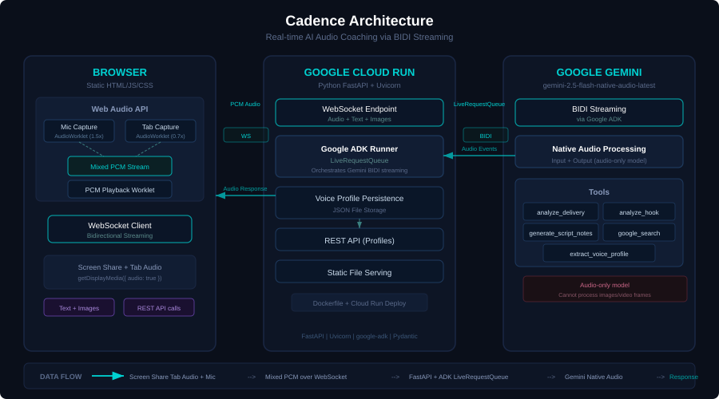

# Cadence

**An AI creative director that learns how you perform from your real audio, not from transcripts.**

Most AI writing tools read your words. Cadence listens to your delivery. It streams the actual audio of your videos into a native-audio model and learns the things a transcript throws away: your pacing, where your humor lands, how you build and release tension, the shape of your hooks. Then it co-writes scripts in that voice, line by line, with delivery coaching woven in.

[**Live demo**](https://cadence-862848485146.us-central1.run.app) · Requires Chrome (tab-audio capture uses `getDisplayMedia`).



---

## The core idea: audio, not transcripts

A transcript tells you *what* a creator said. It cannot tell you *how* they said it, and the "how" is the entire craft. The half-second pause before a punchline. The voice that drops on the scary part and lifts on the release. The rapid-fire open that slows to a deliberate close.

Cadence sends the raw 16kHz PCM audio of your performance straight to Gemini's native-audio model. No speech-to-text step, no lossy transcript in the middle. The model hears the delivery and builds a voice profile from it, then carries that profile forward so every session understands you a little better.

This is the whole bet, and it is what the architecture is built around.

## Architecture



The pipeline is real-time and bidirectional end to end:

1. **Capture (browser).** Three `AudioWorklet` processors run off the main thread: mic capture at 1.5x gain, tab-audio capture at 0.7x gain, and 24kHz PCM playback. Mic and tab audio are mixed into a single 16kHz PCM stream so the model hears both your voice and the video you are reacting to.
2. **Transport (WebSocket).** The mixed PCM streams to a FastAPI backend over a WebSocket. Each chunk is tagged with a one-byte prefix so the server can tell mic from tab audio.
3. **Stream to the model (BIDI).** The backend feeds audio through Google ADK's `LiveRequestQueue` into Gemini's bidirectional streaming API. Gemini streams 24kHz voice back through the same socket to the browser's playback worklet.
4. **Remember (persistence).** As the agent analyzes a session, the structured pieces it extracts (signature moves, hook patterns, pacing, humor, emotional arcs) are merged into a per-creator voice profile on disk and re-injected as context at the start of the next session. The profile gets richer the more you use it.

### What the model does each session

- **Study.** While your video plays, Cadence listens and calls out the patterns it hears: the recurring hook shape, the tone shifts, the pacing signature.
- **Scout.** Ask what to make next and it uses Google Search to find trending formats, then filters them through your specific delivery style.
- **Create.** Ask for a script and it writes the whole thing, hook to close, with a bracketed delivery direction after each line, using the hooks and signature moves from your profile.

## Tech stack

| Layer | Choice |
| --- | --- |
| Model | Gemini 2.5 Flash Native Audio (`gemini-2.5-flash-native-audio-latest`) |
| Agent framework | Google ADK (BIDI streaming via `LiveRequestQueue` + `Runner`) |
| Backend | Python, FastAPI, Uvicorn |
| Frontend | Vanilla JavaScript, Web Audio API (`AudioWorklet`) |
| Streaming | WebSocket (client to server), BIDI (server to Gemini) |
| Deploy | Docker on Google Cloud Run |
| Tests | Playwright (end to end) |

## Run it locally

**Prerequisites:** Python 3.12+, Node 18+ (for the tests), and a Google API key with Gemini access.

```bash
git clone https://github.com/brookejlacey/cadence.git
cd cadence

cp app/.env.example app/.env
# add your GOOGLE_API_KEY to app/.env

pip install -r requirements.txt
python app/main.py
```

Open `http://localhost:8000` in Chrome, click **Start Session**, share a tab with a video playing (check "Share tab audio"), and start talking.

### Tests

```bash
npm install
npx playwright install chromium

python app/main.py &
npx playwright test
```

### Deploy to Cloud Run

```bash
gcloud auth login
gcloud config set project YOUR_PROJECT_ID
./deploy.sh
```

`deploy.sh` builds from source and deploys with session affinity and a long request timeout, both of which the long-lived audio socket needs.

## Engineering decisions worth calling out

- **Audio-only is a feature, not a limitation.** Gemini's native-audio model takes audio, not video frames. It turned out vocal delivery carries most of the signal that makes a creator recognizable, so working in audio is cheaper and loses little.
- **One mixed stream beats two.** Sending mic and tab audio as separate streams tripped rate-limit disconnects. Mixing them into a single gain-balanced PCM stream fixed it.
- **The BIDI stream drops, so the server heals it.** Gemini's live stream ends periodically. The server restarts it (up to five retries) behind a stable client WebSocket, swapping in a fresh `LiveRequestQueue` without the browser noticing.
- **Voice-first, no live captions.** The chat panel is for typed messages and system notes. Cadence's spoken responses are the product, so there is no janky real-time transcription competing with them.

## Project structure

```
cadence/
├── app/
│   ├── main.py                       # FastAPI server + WebSocket BIDI handler
│   ├── profiles.py                   # Voice profile persistence (JSON)
│   ├── cadence_agents/
│   │   ├── agent.py                  # The Cadence coordinator agent
│   │   └── tools/content_analysis.py # Delivery + hook + script tools
│   └── static/
│       ├── index.html
│       ├── css/style.css
│       └── js/
│           ├── app.js                # Frontend app + WebSocket client
│           ├── audio-player.js       # 24kHz PCM playback
│           ├── audio-recorder.js     # 16kHz mic capture
│           └── pcm-*-processor.js    # AudioWorklet processors
├── tests/e2e.spec.js                 # Playwright E2E suite
├── architecture.svg
├── deploy.sh
├── Dockerfile
└── requirements.txt
```

## License

MIT. See [LICENSE](LICENSE).
